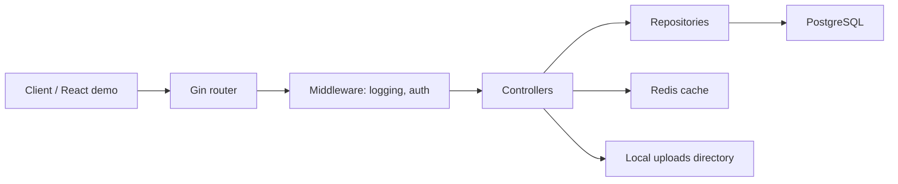

# Go Mercari Clone

A backend-focused marketplace API inspired by Mercari, built with Go, Gin, PostgreSQL, Redis, JWT authentication, and Docker Compose.

This project demonstrates practical backend engineering topics for an e-commerce style product: user authentication, item listing, seller ownership, image upload, search and pagination, Redis caching, structured logging, Swagger API documentation, and transaction-safe purchasing with PostgreSQL row locking.

The repository also includes a lightweight React/Vite client for local API demo purposes.

## Highlights

- JWT-based registration and login flow with bcrypt password hashing.
- PostgreSQL persistence through GORM models and repositories.
- Redis cache-aside implementation for item list queries.
- Transaction-safe item purchase using `SELECT ... FOR UPDATE` via GORM row locking.
- Layered backend structure with controllers, repositories, models, middleware, and database packages.
- Multipart image upload support with static file serving from `/uploads`.
- Swagger documentation generated with `swaggo`.
- JSON structured request logging using Go `slog`.
- GitHub Actions CI for build and test checks.
- React/Vite demo frontend for browsing items from the API.

## Tech Stack

| Area | Tools |
| --- | --- |
| Backend | Go, Gin |
| Database | PostgreSQL, GORM |
| Cache | Redis |
| Auth | JWT, bcrypt |
| API Docs | Swagger, swaggo |
| Testing | Go testing, testify |
| DevOps | Docker, Docker Compose, GitHub Actions |
| Frontend demo | React, TypeScript, Vite |

## Architecture



The backend keeps HTTP handling, persistence, authentication, and infrastructure concerns separated:

- `main.go` wires the application together, configures middleware, registers routes, and starts the server.
- `controllers/` translates HTTP requests into application actions and JSON responses.
- `repository/` owns database access and transaction logic.
- `models/` defines GORM entities and JSON shapes.
- `middlewares/` handles cross-cutting behavior such as JWT verification and structured request logs.
- `database/` initializes PostgreSQL and Redis clients.
- `utils/` contains shared helpers such as JWT generation and verification.
- `frontend/` contains a simple React client used to display marketplace items.

For a deeper walkthrough, see [`docs/ARCHITECTURE.md`](docs/ARCHITECTURE.md).

## Features

### Authentication

- `POST /register` creates a user with a bcrypt-hashed password.
- `POST /login` verifies credentials and returns a JWT.
- Protected routes require `Authorization: Bearer <token>`.

### Marketplace Items

- `GET /items` lists items with pagination and keyword search.
- `POST /items` creates a new item for the authenticated user.
- `POST /items/:id/buy` purchases an item inside a database transaction.
- `POST /items/:id/image` uploads and links an image to an item.

### Caching

`GET /items` uses Redis as a cache-aside layer. Query parameters such as `limit`, `offset`, and `search` are included in the cache key to avoid returning mismatched result sets.

### Concurrency Control

The purchase flow locks the selected item row during the transaction. This prevents two buyers from successfully purchasing the same item at the same time.

## Getting Started

### Prerequisites

- Go 1.25+
- Docker and Docker Compose
- Node.js and npm, only if you want to run the React demo

### 1. Configure environment variables

Create a local `.env` from the example file:

```bash
cp .env.example .env
```

Use `DB_HOST=localhost` when running the Go API directly on your machine with PostgreSQL running in Docker. Use `DB_HOST=db` when running the Go API inside Docker Compose.

### 2. Start PostgreSQL and Redis

```bash
docker compose up -d db redis
```

### 3. Run the backend locally

```bash
go run main.go
```

The API server starts on `http://localhost:8080`.

### 4. Open Swagger UI

```text
http://localhost:8080/swagger/index.html
```

### 5. Run tests

```bash
go test ./...
```

### 6. Run the React demo client

```bash
cd frontend
npm install
npm run dev
```

The Vite dev server usually starts on `http://localhost:5173`.

## Docker

Run the backend and database stack:

```bash
# Make sure DB_HOST=db in .env before running the API container.
docker compose up --build
```

Stop services while keeping volumes:

```bash
docker compose down
```

Remove services and local database/cache volumes:

```bash
docker compose down -v
```

## API Examples

See [`docs/API_EXAMPLES.md`](docs/API_EXAMPLES.md) for sample `curl` requests covering registration, login, item creation, listing, purchase, and image upload.

## Project Structure

```text
.
├── controllers/        # HTTP handlers and controller tests
├── database/           # PostgreSQL and Redis initialization
├── docs/               # Swagger output and project documentation
├── frontend/           # Lightweight React/Vite demo client
├── middlewares/        # JWT auth and structured logging middleware
├── models/             # GORM models
├── repository/         # Persistence and transaction logic
├── uploads/            # Uploaded item images during local development
├── utils/              # Shared utility code
├── Dockerfile
├── docker-compose.yml
└── main.go
```

## CI

GitHub Actions runs:

```bash
go build -v ./...
go test -v ./...
```

on pushes and pull requests targeting `main` or `master`.

## Current Scope And Limitations

This is a portfolio project focused on backend architecture and practical API behavior, not a production marketplace service. The React app is intentionally small and serves as a demo client. Production hardening work would include stricter CORS settings, external object storage for uploads, secret management, database migration tooling, health checks, retry logic, and deployment configuration.
