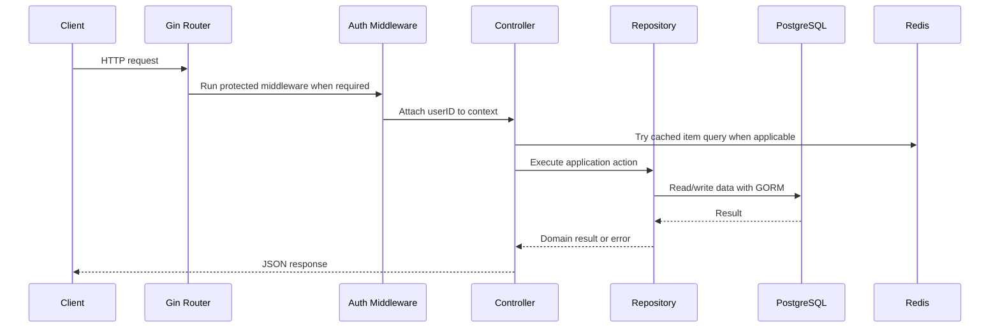

# Architecture

This project is a backend-focused marketplace API designed around a simple layered architecture.

## Request Flow



## Layers

### Router and Application Wiring

`main.go` initializes the application:

- Configures JSON structured logging through `slog`.
- Connects to PostgreSQL and Redis.
- Builds the `ItemController` with an injected `ItemRepository`.
- Registers public routes such as `/register`, `/login`, and `GET /items`.
- Registers protected routes under JWT middleware for item creation, purchase, and image upload.
- Serves uploaded files from `/uploads`.
- Exposes Swagger UI at `/swagger/index.html`.

### Controllers

Controllers translate HTTP concerns into application operations:

- Parse path parameters, query parameters, JSON bodies, and form uploads.
- Validate basic request shape through Gin binding.
- Call repositories for persistence-oriented behavior.
- Return meaningful HTTP status codes and JSON responses.

Examples:

- `ItemController.FindAll` handles pagination, search parameters, and Redis cache lookup.
- `ItemController.Create` reads `userID` from the authenticated request context.
- `ItemController.BuyItem` maps a sold-item conflict to HTTP `409 Conflict`.

### Repositories

The repository layer owns database access and transaction behavior.

`ItemRepository` is defined as an interface so controllers can depend on behavior instead of directly depending on `*gorm.DB`. This makes controller tests easier because a mock repository can be used instead of a real database.

The purchase flow uses a GORM transaction and row-level locking:

```go
tx.Clauses(clause.Locking{Strength: "UPDATE"}).First(&item, itemID)
```

This maps to PostgreSQL's `SELECT ... FOR UPDATE`, preventing concurrent buyers from both purchasing the same item.

### Models

GORM models define persistence structure and JSON output:

- `User` includes unique username and email constraints.
- `PasswordHash` is excluded from JSON output with `json:"-"`.
- `Item` includes seller ownership through `UserID` and `User`.

### Middleware

Middleware handles cross-cutting request behavior:

- `AuthMiddleware` validates Bearer tokens and stores `userID` in Gin context.
- `StructuredLogger` records method, path, status, latency, and client IP in JSON format.

### Cache

The item listing endpoint uses a cache-aside pattern:

1. Build a Redis key from `limit`, `offset`, and `search`.
2. Try Redis first.
3. If cache misses, query PostgreSQL through the repository.
4. Store the result in Redis with a short TTL.
5. Return the response.

## Design Tradeoffs

- The project prioritizes clarity over deep abstraction. It uses controllers and repositories without adding a separate service layer.
- Uploaded files are stored locally for development simplicity. Production systems would use object storage such as S3 or GCS.
- Swagger files are generated output and should be regenerated when API annotations change.
- The React frontend is a small demo client, not the main engineering focus of this repository.

## Production Hardening Ideas

- Move secrets such as JWT signing keys fully into environment configuration.
- Add health checks for PostgreSQL and Redis.
- Add retry or graceful degradation around Redis startup.
- Replace `AutoMigrate` with explicit database migrations.
- Store uploaded files in object storage.
- Tighten CORS origins for deployed environments.
- Add integration tests around authentication and purchase concurrency.
